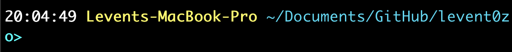

# Terminal and Bash

## TL;DR

If you're new to the world of command-line programming on the Mac using Bash, or you just need a quick refresher then this post is for you. We will talk about how to install a better terminal (iTerm2), and go over the essential concepts and commands, before we look at scripting commands. 

## A Little Back Story

For about 2 decades, I’ve developed software primarily on the Windows platform. It’s been a couple of years since I switched to using macOS. As anyone’s who’s made the switch will concur, it can be quite disorienting at first. Basic tasks I was fluent in suddenly became things I needed to figure out how to do. Applications were different, keyboard shortcuts were different, the command console was different. I remember spending a bunch of time trying to figure out how to delete a character, since the MacBook keyboard lacks a dedicated delete key, and only has backspace.

One of the things I had to learn quickly was how to use the command console. On Windows, it’s called ***Command Prompt***, and on the Mac it’s called ***Terminal***. These are applications which run a *shell*, which then allow you to submit commands to the operating system or run other applications, typically via their ***Command-Line Interface***. The ***CLI*** is basically a set of commands and parameters an application understands.

On Windows, the original Command Prompt is based on ***MS-DOS***. On the Mac, the Terminal shell ***Bash*** is based on the original Unix shell ***sh***. (Bash stands for "Born Again Shell") The saving grace, as always, is that concepts remain the same, it’s just a matter of learning a new language, its syntax and grammar and of course, its idiosyncrasies.

In this blog, I want to focus on how to use the Terminal to get basic things done effectively. As developers, we often use tools that don’t have a ***Graphical User Interface***, and even if they do, the ***GUI*** is typically not as powerful as the CLI. If we want to automate any task as a developer we need to use the CLI.
 

# The Terminal

What if you could talk to your computer? Wait, scratch that.. nobody wants to “talk” these days. Everybody wants to “text”. What if you could text with your computer? That’s exactly what the CLI is about.

To launch terminal on the mac, you can go to Launchpad and search for it. A quicker way is to activate ***Spotlight*** using `CMD+Space` and type in `terminal.app`. Terminal runs bash as its default shell. (Update: On macOS Catalina, the default shell is now ***zsh***, which for most intents and purposes should work like Bash).

The built in terminal is pretty bare-bones, so I recommend that you install a better terminal: ***iTerm2***. 

As with most things, getting started is the hard part. To download iTerm2, we will first install ***brew***, which is “The Missing Package Manager for macOS”.

Execute the following command in the built-in terminal:

```bash
/bin/bash -c "$(curl -fsSL https://raw.githubusercontent.com/Homebrew/install/master/install.sh)"
```

This is a quick flash-forward introduction to a command. We’ll get into things like this but let’s take a brief look.

When you enter a command in the terminal, the first token is always the ***executable*** file. Everything else that follows is a ***parameter*** (better known as an ***argument***) to that command. The shell tokenizes input based on white-space, so if you have a space you want to preserve in your argument, you need to use quotes.

/bin/bash ← The bash executable in the bin subfolder of root folder.
-c ← First argument, which tells bash that the input is a string.
The second argument to bash is the evaluation of the expression:
`$(curl -fsSL https://raw.githubusercontent.com/Homebrew/install/master/install.sh)`

Bash recognizes the special `$(...)` syntax as another bash command, which will run first, before its result is passed to the bash command.  This command calls the `curl` executable, with the first argument being `-fsSL` and the second argument being the URL.

So what this ends up doing is downloading an installer script from the specified URL, outputting it to the console, which the shell puts into a string variable and passes it to the executable (in this case, bash again), which then executes that script.

Don't worry if this seems complicated, once we get further along, it will make mroe sense.


Once brew is installed, you can proceed to install iTerm2:

```
brew cask install iterm2
```

To launch it, activate Spotlight (`CMD+Space`) and type in `iterm.app`.


## Navigating inside the shell

When the shell is not running an application, it waits for commands in what’s called ***REPL***: Read, Eval(uate), Print Loop. When the shell is in this mode, you can put in new commands and edit the current command as if in a single-line text editor.  

If you have a rich keyboard that includes home and end keys, you’ll soon realize that not all applications or controls within the applications work with these keys. It’s important to learn these keyboard shortcuts to be efficient on the terminal:

|Keys	|Action	|
|---	|---	|
|Up	|Previous Command in History	|
|Down	|Next Command relative to current location in history	|
|CTRL+A	|Jump to beginning of line	|
|CTRL+E	|Jump to end of line	|
|CTRL+U	|Delete to beginning	|
|CTRL+K	|Delete to end	|
|CMD+Left	|Jump to beginning of paragraph	|
|CMD+Right	|Jump to end of paragraph	|
|Option+Left	|Jump to beginning of previous word	|
|Option+Right	|Jump to end of next word	|

If you hold down the shift key while moving the cursor, it will toggle selection of the text range traversed.

To clear the screen, use the **`clear`** command.

You can see the previous commands you entered using the **`history`** command. Use `CMD+T` to create a new shell tab, or `CMD+N` to create a new terminal window. Use the **`exit`** command to make the current tab go away.

Finally, some commands support auto-completion which can be activated by pressing `tab`. If you’re in the middle of typing in the name of a file where the shell can access it, pressing `tab` will auto-complete it on the first try, unless there are multiple matches. In this case nothing will happen on the first try but a subsequent pressing of the `tab` will show the matching entries without losing your entry. (Note: This behavior is shell/configuration specific.)


# iTerm2 Profiles (Intermediate)

Profiles allow you to specify options for the command shell. One of my favorite features of iTerm2 is called “Triggers“.  

**Triggers** ”watch for text matching a regular expression to arrive in a terminal session and then perform an action in response“. There are quite a few trigger types, but the two that I use are ”Highlight Text“ and ”Post Notification“. 

To specify triggers, go to iTerm2 Preferences (`CMD+,`) and select `Profiles` in the top bar. Next, select the `Advanced` tab and click the `Edit` button under the `Triggers` section. 


Here are a few useful regular expressions: 
- Paths: `(/?[\w\.\-~]+/)+([\w\.\-~]+)*`
- Filenames: `(?>([\w\!-]*\.)+[\w\!-]+)(?!\/)`
- URLs: `[A-Za-z]+://\S+`

You can [download](https://gist.github.com/Levent0z/a8f3b8557f2f707c113c74fc55ec069e#file-iterm2-profile-json) the triggers I've defined and import them into iTerm2 under `Other Actions...` in the `Profiles` tab.


# CLI Patterns

So before we move on, let’s take a quick look at various CLI patterns. Here’s one that demonstrates a common CLI pattern:

`path/executable commandArg -f --flag -a --argument value --key=value filepath`

If we tokenize the arguments to the executable, we see that there are 7 tokens. How the executable interprets these tokens is completely proprietary, but there are conventions:

- Anything that follows a single dash is either a flag or an option indicator.
  - A “flag” changes or overrides the default operation of the executable. 
  - An “option indicator” indicates that the subsequent token is a value for the option.

- Typically, single-dashes are used for single-letter identifiers, and they can be case-sensitive.

- More human-readable options are preceded with double-dashes. Using double-dashes also allows an option to have a name with multiple words separated by a single dash.

- Some options are key-value pairs and require equals sign as the separator.

- The last token is typically the file that the executable operates on.

There are some other patterns that you might see. If you’re a JAVA developer, in Maven, you have the -Kvalue pattern:

```bash
mvn -DskipJsDoc -DskipUnitTests -DskipComponentCompile -Djava.compiler=NONE -Xrunjdwp:transport=dt_socker,server=y,suspend=y,address=8000
```

For Maven, `-D` stands for definition of build-time arguments, and ordering doesn’t matter. Also note how some options have their own proprietary syntax.


## Watch Out!

When typing or copying/pasting text, watch out for automatic transformation of similar looking characters:

* Two dashes `--` replaced with a hyphen `—` 
* `“`Paired double-quotes`”` masquarading as stand-alone `"` double-quotes.


## How to get Help

Many CLI commands support a built-in help function. You can typically invoke it with one ore more of the following: `-?`, `-h` or` --help`. 

Some CLI commands, when run without any arguments will display their usage. Be careful though, some CLI commands will switch into a mode where they expect you to provide input using the keyboard. You can cancel out by pressing `CTRL+C`.

The usage listing is typically useless, because it only shows you what the various options are and what the CLI pattern is, but not what it does. A usage might look like this:

```bash
> find
usage: find [-H | -L | -P] [-EXdsx] [-f path] path ... [expression]
       find [-H | -L | -P] [-EXdsx] -f path [path ...] [expression]
```

This shows that the find command takes a number of optional and mutally-exclusive options, followed by a number of optional, case-sensitive single-letter switches that can be grouped as a single argument. It can accept one or more paths, and the first path could be preceded with the `-f` switch. 

In usage, square brackets `[]` mean optional, angular brackets `<>` mean required. Angular brackets may be omitted as it may be implied.

On macOS, there’s a built in command called `man`. This will display the “manual” for a command, and typically will include the usage, explanation for options and hopefully examples, especially towards the end. 


```bash
> man
What manual page do you want?
```

For example, 
`man find` will display the manual for the find command. On my system, it uses `less -is` as the default pager, which allows you to scroll the content using up/down cursors and space. At the bottom is the command prompt, prefixed with `:`. To search for a keyword, switch to search mode by typing `?` and then entering a keyword. To quit, enter `q` at the prompt with the colon.

(Note, you can specify a pager by ***piping*** the output to a paging utility. Eg. `man find | more`)

Finally, I recommend https://ss64.com/osx/ as a reference, which lists most (if not all) bash commands and has documentation.


# The 3 Channels

The operating system provides an application 3 channels: ***STDIN***, ***STDOUT*** and ***STDERR***. These channels correspond to the standard input, output and error channels. The input channel is typically the keyboard, and the standard out is the terminal or console. Standard error is a separate channel intended to keep error messages separate from an application’s, well, standard output, but typically is also the screen. 

It’s possible to redirect the channels to a file or from a file. The following examples redirects STDOUT to a file called list.txt:

```bash
ls > list.txt
```

Using a single **`>`** will **overwrite** the file if it exists. If you want to **append** to the file if it exists, use double angular brackets: **`>>`**.

It’s possible to redirect the output to void, so it’s completely discarded:

```bash
ls >/dev/null
```

This could be useful if you’re writing a script and want to silence a command and have a better control on what’s output to the user.

To redirect STDERR use a slightly different version of redirection: **`2>`** . The following example tries to list a possibly non-existent directory, where the listing of the directory goes to out.txt and error messages go to err.txt:

```bash
ls /path/maybethere >out.txt 2>err.txt
```


If a command expects input from the keyboard, you can provide the input from a file. The following example redirects a file as input using the left-angle bracket symbol (**`<`**):

```bash
(read input; echo "You entered $input") < input.txt
```

This example also gives an introduction to a number of other symbols: The `read` and `echo` commands are separated with the semi-colon **`;`** which allows us to put multiple commands on one line. They are grouped using parantheses so that the input file is directed at `read` not `echo`.

The triple-left-angle-bracket (**`<<<`**) redirects the value of a variable into input. The following example is equivalent to echo’ing the home directory of the logged-in user:

```bash
(read line; echo $line) <<< $HOME
```


The power of the shell scripting comes through via the ability to redirect the output of an application as an input to another. This is achieved through ***piping***, by separating CLI commands with the pipe character (**`|`**). Example:

```bash
ls | sort
```

## Multiple Ways to Provide Input 

It’s important to realize that different commands can expect/accept input in various ways:

1. The data could be passed in as an **argument**
2. The data could be in a file, and the **path to the file** is passed as an argument
3. The data could be input via the **keyboard** or **piped in** (STDIN)
4. **Environment** variables (more on this later)


To pipe the STDOUT of a command to another that accepts input as an argument, use **`xargs`**. For example, many file-system commands take their inputs as arguments. The following removes all temporary files in the current directory and below:

```
find . -type f -name "*.tmp" | xargs rm
```

The `find` command recursively looks for files whose name matches the **GLOB** expression, outputs their full-path to STDOUT, which gets piped into `xargs`. For each line it receives, `xargs` converts the line into an argument and passes it to `rm` as an argument, thereby deleting the file. 


# Environment Variables

I mentioned earlier that one of the inputs to a CLI, if it supports it, is the environment variables. These are simply key-value pairs where the user has control of what the value is. They are not protected in any way. To view these, use the **`env`** command.

```bash
env | sort
```

To set a variable, simply do `VARIABLE_NAME=VALUE`, paying attention to the fact that there are no spaces before and after the equals sign.


```bash
> MY_VAR="Hello World"
> echo $MY_VAR
Hello World
```

To use the value held by a variable use the **`$`** sign. Also acceptable is the **`${MY_VAR}`** syntax, which uses curly-braces.

Your variable will live for the remainder of your terminal session, unless it’s cleared using the **`unset`** command. Also, keep in mind that the new value will not automatically carry over to any new or existing terminal sessions.

Note: If you’re setting the variable inside a script and want it to be available outside of the script, prefix the assignment with the **`export`** command.

Here are a few examples of important environment variables for developers: 
`JAVA_HOME`, `M2_HOME`, `GIT_SSH_COMMAND`.


# Aliases

Aliases are a convenient way to name frequently used commands or command sets. To list existing aliases use the **`alias`** 
command with no arguments. To set an alias simply pick an otherwise unused name and assign a value to it. For example:

```bash
alias gs='git status'
alias ll='ls -hpGoal'
```

Aliases then become mini-scripts, which can be executed. Any arguments specified after the alias will be concatenated to the value of the alias. However, it’s not possible to pass in an argument into the value of the alias. For that, we need to use functions (more on this later).

Once an alias is defined, it lives until the end of the session, so aliases should be specified in the shell configuration.


# The File System

When a terminal is started, it’s started in a folder on the file system. Depending on your configuration, this can be your user folder, or the root folder. To view your current working directoy, use the **`pwd`** (Print Working Directory) command.

The file-system is organized in a hierarchical fashion called a ***tree***. It’s really like an upside-down tree, where the root is at the top, and everything else is a descendant of the root. A ***folder*** is a grouping that contains other files or folders. The ***root folder*** is represented by a stand-alone slash ***`/`***. Each file or folder is uniquely identified with its “path”. A path can be “absolute” or “relative”. An ***absolute path*** starts at the root, whereas a ***relative path*** starts at the current working directory.

Because of the tree hierarchy, every file and folder except the root has a parent folder. The parent folder is represented with double-dots ***`..`*** and the current directory is represented with a single dot ***`.`***. Folders in a path and the file at the end of path are separated using the path separator slash. If the path *starts* with a slash, it represents an absolute path.

There are multiple ways to indicate the same path. For example, the path `/a/b/c/../..` would be the same thing as `/a`.

Finally, the “tilde” character **`~`** represents the currently logged-in user’s home folder. 

Knowing where you are in the file system is important because CLI commands are context-sensitive, meaning that if they accept filenames as arguments, they will be using the current directory as the starting point for any relative paths specified. A filename without a path implies the current directory. If there are spaces in the path, either use the backslash (**`\`**) before the space to “escape” it, or enclose the full path within double-quotes.

To change the current directory use the **`cd`** command. You can also use **`pushd`** which works like `cd` but puts the current working directory to a stack. You can go back in the stack using **`popd`**.

Given a file path, you can extract the filename and the path to the file using **`basename`** and **`dirname`** commands respectively. Keep in mind however, that `dirname` is basically a string operation and doesn’t resolve a relative path to an absolute path. To get the full path of a given file, you can use a combination of `pwd` and `dirname` or use a 3rd party tool. See `function` examples towards the end of this document.


## Paths

On Bash, to execute an application or a script (collectively called an executable), a path must be specified (unlike filenames as arguments, the current folder isn’t implied). For example, to execute a bash script in the current folder, we would do `./script.sh`. Having to specify the path to an executable quickly becomes cumbersome. For this reason, the shell uses the **`PATH`** environment variable, which lists a set of folders that the shell should go looking in when an executable without a path is specified.

```bash
> echo $PATH
/Users/loz/.ansible:/Users/loz/.ansible/py3/bin:/Users/loz/.ansible/bin:/Users/loz/bin:/Users/loz/.nvm/versions/node/v10.15.3/bin:/usr/local/bin:/usr/bin:/bin:/usr/sbin:/sbin:/Users/loz/.ansible
```

The paths are separated by **colons** on macOS (unlike in Windows, which uses semi-colons). To add a folder to a path, you can do:

```bash
export PATH="/my/new/absolute/path":$PATH
```

The `export` command makes the new value available outside of the scope where the variable is defined.

The ordering of paths defined in PATH is important. The shell searches the paths from left-to-right, and the first executable found will be used. The same path can exist in the PATH variable multiple times without repercussions. To persist the PATH setting across reboots, it must be set in the shell’s configuration file.


> Tip: If you’re a developer who uses Visual Studio Code, you can add it to the path so it can be launched with `code` , execute `Shell Command: Install ‘code’ command in PATH`  in the command palette. (`CMD+SHIFT+P`)


To find out where an executable is retrieved from, use the **`which`** command.

```bash
> which which
/usr/bin/which
```


## List of Common File Management Commands

|Action	|Bash	|NOT	|	|
|---	|---	|---	|---	|
|List a file	|**ls** fileorfoldername	|dir	|	|
|List a file with metadata	|**ls** -hpGoal fileorfoldername	|dir	|	|
|Create a folder	|**mkdir** foldername	|md	|	|
|Delete an empty folder	|**rmdir** foldername	|rd	|	|
|Delete a non-empty folder	|**rm** -r foldername	|rmdir	|	|
|Create an empty file	|**touch** filename	|	|	|
|Delete a file	|**rm** filename	|del	|	|
|Copy a file, keeping the name	|**cp** sourcefile targetpath	|copy	|	|
|Copy a file, set a new name	|**cp** sourcefile targetpath/newname	|copy	|	|
|Move a file or folder	|**mv** source targetpath	|move	|	|
|Rename a file or folder	|**mv** source targetpath/newname	|ren	|	|
|View / change properties of a file	|**chmod** fileorfoldername	|attrib	|	|


## GLOB Patterns

Many file system commands recognize GLOB patterns. These are expressions that allow you to specify part of a filename or its extension. (The extension is the part of the filename that follows the last dot.) GLOB patterns use the asterisk **`*`** to represent 1 or more unspecified characters and the question mark **`?`** to specify exactly one unspecified character. For example, to list only `.json` files, we can do:

```bash
ls *.json
```

It’s important to keep in mind that different commands may use GLOB patterns differently. For example, `ls *` lists all files and folders recursively. The `find` command will apply the glob pattern individually to the extension and filename, so watch out.

Quick note about hidden files: By default, files that start with a “dot” are hidden from listings.  You may need to specify additional arguments to include these files or folders. For example: `ls -a`.


## Finding Files by File Properties

We’ve already seen that we can use the `ls` command to get listings of files. A more powerful way to find files is through the use of the **`find`** command, which does a depth-first search starting from the specified path.

I find the CLI pattern of `find` to be slightly unusual because it requires the path to search to be defined before the search expression. (Intuitively speaking, I would expect the path to be the last argument.)

The following finds all JavaScript files which start with the “uti” prefix in the current directory and below:

```bash
find . -type f -name "uti*.js"
```

This is also a good reminder that the glob pattern applies to path, filename and extension separately. Note that quoting the glob pattern may be necessary or you will get a misleading “`unknown primary or operator`“ error message.

The `find` command is very powerful, and since this is an introductory course, I won’t get into it in more detail. The “80% problem” is often trying to locate a file given limited knowledge about it: we know where a file lives in a broad sense and we know parts of the filename or its extension. For this, I recommend using a 3rd-party utility called “fuzzy find“, AKA `fzf`.

To install **`fzf`** do:

```bash
brew install fzf
```

When you launch `fzf`, it immediately starts indexing all the files and folders that it find and you can start typing what you’re looking for without having to wait for it to finish. `fzf` filters in “fuzzy-mode” which means that matches are determined based on the order of characters that you type, where the characters don’t necessarily need to be consecutive. 

For example, if you typed in XYZ, this would be *similar* to using a glob pattern `*X*Y*Z*` where `*` here means 0 or more characters.

`fzf` is very powerful and can integrate with other editors. To see the options, do `fzf --help`.  You can set `fzf` options using the `FZF_DEFAULT_OPTS` environment variable. This is what I use:


> FZF_DEFAULT_OPTS=--height 50% -1 --reverse --multi --inline-info --preview='[[ $(file --mime {}) =~ binary ]] && echo {} is a binary file || (bat --style=numbers --color=always {} || cat {}) 2> /dev/null | head -300' --preview-window='right:hidden:wrap' --bind='**f3**:execute(bat --style=numbers {} || less -f {}),**f2**:toggle-preview,**ctrl-d**:half-page-down,**ctrl-u**:half-page-up,**ctrl-a**:select-all+accept,**ctrl-y**:execute-silent(echo {+} | pbcopy)‘


Pressing any of the keyboard shortcuts in **bold**, listed above, will activate the assigned function. For example `f2` will toggle the preview using the configured viewer. 

The following are aliases I find to be useful:

```bash
alias fz='fzf -q' *# Requires an argument*
alias fze='fzf -e +i' *# Fuzzy find exact, case-sensitive*
```

## Finding Files by Content

To search a file for a specific text or regular expression use **`grep`** and **`egrep`** respectively. `grep` searches case-sensitively, unless the `-i` option is specified. Grep can also be used to interpret its keyword as a regex with the `-E` option, in which case it’s the same as calling `egrep`.

|Find simple keyword in one ore more files	|grep keyword filename1 filename2 ...	|
|---	|---	|
|Find space-separated keywords (on the same line) in file	|grep "keyword1 keyword2" filename	|
|Find multiple keywords anywhere in file	|Left to the reader as homework	|
|Find keyword recursively in specified directories	|Use `-R` or `-r` or `--recursive`	|
|Show context around matching lines	|Use `-C num` where num is a number	|
|Display count of matching lines	|Use `-c` or `--count` option	|
|Colorize matches	|Use `--color` or --`colour`	|
|List only filenames of matching entries	|Use `-l` 	|

There are many options to grep, and more options can be found via `man grep`.

It’s common to pipe output into grep for convenience. For example, if you can’t remember the alias for a command, you can do:

```bash
alias | grep commandname
```


## Viewing Content in Text Files

As developers, we deal with a lot of text files, for source code and configuration. If you don’t want to launch a full-fledged application just to view the content, we can do it in the shell.

The command **`cat`** is the basic viewer. Usage is simple:

```bash
cat filename
```

`cat` will simply output the whole text file onto STDOUT. This is great if you’re processing the file line-by-line inside a script, but if you just want to view it, you’ll need a pager. Simply pipe the output to a pager like **`more`** or **`less`**. That’s about it, more-or-less.

There’s a `cat` alternative called **`bat`**, which supports syntax-highlighting and line numbers. To install it:

```bash
brew install bat
```

To set the pager for BAT, set the environment variable:

```bash
export BAT_PAGER="less -R"
```


# Text Processing

If you want to edit a file, you can use the oldest editor that I know of: **`vi`**. There are still many users who love `vi`, and I suspect once you memorize all the keyboard shortcuts it’s pretty powerful. `vi` has the concept of a “mode”, where keyboard input is either used to enter a command or directly edit the file. The only thing *everybody* needs to know about `vi` is how to quit it. To do that, enter the `:` character to put it into command mode, then enter `q`. 

A more easier to use editor is **`nano`**, which displays commonly-used (and more mainstream) keyboard shortcuts at the bottom. For interactive editing, **VS Code** is arguably the best text editor, but `nano` and `vi` has the advantage of being pre-installed.

Oftentimes, you want to shape the STDOUT of a command before displaying or piping to another a command. This is a common task when scripting. There are built-in commands that help you with these.

The **`head`** command outputs up to the specified number of lines from the beginning of its input.
The **`tail`** command outputs up to the specified number of lines from the end of its output. 

```bash
cat testfile.txt | head -10 # first 10 lines
cat testfile.txt | tail -10 # last 10 lines
```

`tail` can also be used to skip the first few lines using the **`+`** prefix before the line. The number is the line number to start from, not the number of lines to skip. In other words, if you want to skip the first lune, specify `+2`. Tail doesn’t accept the `+` and `-` arguments at the same time, but the intent can be achieved via piping.

The command **`wc`** is used to count lines, words and characters. When used without arguments, it displays all counts in that order. To get these numbers individually 

```bash
cat testfile.txt | wc -l
```


## EXERCISE
**Question**: 

Write a command that will output the fifth entry in the alphabetical listing of the `/bin` folder. 


**Answer**: 
```bash
ls /bin | sort | tail +5 | head -1
```


## A Tip for Developers
A useful thing to do is to monitor certain messages an app outputs to its log files while it is running. The `-f` argument tells `tail` to keep monitoring the file and output newly added lines to its STDOUT. 

**Example**: The following command defines an alias called `tw` which will monitor the hard-coded log file for messages that contain "keyword1", "keyword2" or "keyword3".

```bash
alias tw='tail -f /my/app/logs/output.log | grep -E "(keyword1)|(keyword2)|(keyword3)"'
```

## Other useful commands to know:

**`pbcopy`** Copies its stdin to the clipboard. Practical usage is to pipe data into it. 

```
cat file.txt | pbcopy
```


**`tr`** Replaces or deletes specified text: 

```bash
tr -d ' ' # removes spaces
tr -s "\n" " " # replaces new-lines with spaces`
```

**`cut`** can be used to tokenize and extract substrings from lines

```bash
cut -d ' ' -f2 # takes the second token from a space-delimited list
history | cut -c 8- # Removes the first 8 characters of each line (i.e. removes index)
```


**`sed`** is a powerful text manipulating tool.

```bash
sed '$d'       # Deletes the last line (useful to remove closing braces of JSON)
sed 's/"//g'   # Uses regular expressions to remove double-quotes
```


**`awk`** is another text manipulating tool worth looking into.


# Querying JSON (Intermediate)

From its [website](https://stedolan.github.io/jq/): “jq is a lightweight and flexible command-line JSON processor”

```bash
brew install jq # install jq
```

```bash
cat package.json | jq .scripts # output the scripts object
```

Learning the jq expressions is a good investment if you need to extract values from CLI apps that output in JSON.


**Bringing it all together:**

```bash
cat package.json | jq '.scripts | keys | .[]' | sed 's/"//g' | tr -s "\n" " "
```

Open and read package.json file, inside a JSON object, retrieve the top level “scripts” object, and get all the keys as an array. Replace all double-quotes with nothing using a regular expression, replace new-lines with spaces.


### EXERCISE

Before our next exercise, you will need to learn a few new important concepts:

* To follow a command with another _on the same line_: use a **semi-colon** as delimiter.
* To evaluate a command inside another command, use **`$()`** syntax. 
* To evaluate a mathematical expresion, use the **`$(())`** syntax.


**Question**: 

Given the STATS variable as defined below, output the median value, ideally with a single-line command input.

```bash
STATS="3 9 5 7 8 2 0 9 2 4 8 2 0 1 3 9 4 8 3 6 7 4 1 5 4 8 7 3 5 2 6 1 6 8 1 0"
```

**Answer:**

```bash
_COUNT=$(echo $STATS | tr -s ' ' '\n' | sort | wc -l); _HALF=$(($_COUNT / 2)); echo $STATS | tr -s ' ' '\n' | sort | head -$_HALF | tail -1
```
Note: This is one of many possible answers.


# Processes and Utilities

Once you get more and more comfortable with the shell, you don’t want to leave, and want to do everything on the shell. There’s a certain pleasure of being able to use the keyboard exclusively and not have to touch the mouse or trackpad.

Below, I’ve listed some commands that can help you avoid the Dock, Mission Control, Activity Monitor, and even the browser for downloading files.

|Intent | Command |
|---	|---	|
|Launch an application	|**open** /Applications/*applicationname*.app	|
|List all processes 	|**ps** -a	|
|List auxiliary processes	|**ps** aux	|
|Kill a process 	|**kill** *processid*	|
|Kill all specified processes	|**killall** *commandname*	|
|List all JAVA processes	|**jps**	|
|List open TCP ports	|**lsof** -iTCP -sTCP:LISTEN -P -n	|
|List ports	|**netstat** -an | grep LISTEN	|
|Activate Super User mode	|**sudo** -s	|
|Display current user	| **whoami**	|
|Remote shell to another machine	| **ssh** *arguments*	|
|Download a file	|**curl** *url* -o *outputfile*	|

Both `ssh` and `curl` are must-know commands in a power user’s toolbox, but they’re beyond the scope of this document.


# Bash Configuration

When Bash is launched, it looks for and reads configuration files from a number of fixed locations and depending on how it was launched. For interactive sessions, everyone should know about `~/.bash_profile`, which lives in the logged-in user’s home folder.

**`.bash_profile`** is simply a shell script where you can set environment variables, define aliases and functions, execute regular commands and invoke other shells. Unlike other scripts, it doesn’t have an `.sh` extension, and it doesn’t have to be executable. Any changes to the profile files take effect for the next session. If you’re developing your own config file, you can also **`source`** it as such:

```bash
source ~/.bash_profile
```

Source is a way to call other scripts.

## Changing your Prompt

One of the things that you may want to configure is how your prompt looks in the REPL. This is done by setting the `PS1` environment variable. It has its own little syntax, but it allows you to optionally inject the **time**, the **hostname**, and the current **working directory** and specify colors. This is what I use:

```bash
export PS1='\n\[\e[1;37m\]\t \[\e[1;33m\]\h \[\e[1;36m\]\w\no>\[\e[0;37m\]'
```

... and this is what it looks like:


It even supports emoticons 😃!


## Making a Script Executable

You can also easily write your own scripts using any text editor.

Optionally, add the “shebang” (i.e. hash bang, or hash exclamation point followed by the path to the interpreter) on the first line as follows. This indicates that this is a Bash script, incase the caller is using a different shell.

```bash
#!/bin/bash
```

Once you’re done with your script, make it executable. For example:

```bash
chmod +x script.sh
```


# Bash Scripting (Intermediate)

And with that, let me present you a quick reference for scripting.

## Comments
Anything after the # is a comment until a new line, except in quoted strings and the first line if followed by a !.

## Variables
Case-sensitive. Use ALL_UPPERCASE for naming convention.

### Setting 
- `VAR_NAME=value`
- `declare VAR_NAME=value`

**Important**: There must be no spaces before or after the equals sign.

### Accessing
- `$VAR_NAME`
- `${VAR_NAME}`

The curly braces are recommended. 

### Clearing
- `unset VAR_NAME`
- `VAR_NAME=` 

**Important** Always prefer `unset` as the second method may cause white-space errors: It doesn’t clear the variable, it clears the value of the variable.


### Scope

- Variables are valid in the scope of the script that they’re defined.
- Variables preceded with `local` inside a function definition are local to that function
- Variables that are `export`ed remain in the environment after the script has exited.

### Strings and Quotations

- Double-quoted strings expand variables enclosed within.
- Single-quoted strings are verbatim - no processing.
    - Single-quoted strings prefixed with **`$`** can embed the new-line character `\n`. 
- Text enclosed in back-ticks (**`**) are executed as a command line.

## Branching and Code Flow

### Testing for Values
The `test` command takes in a boolean expression and sets the return code (**`$?`**) to 0 if true, 1 if false.

```bash
a=2
test $a = 2 # true ($? = 0)
test $a == 2 # true ($? = 0)
test $a = “2” # true ($? = 0)
test $a == “2” # true ($? = 0)
test “$a” = 2 # true ($? = 0)
test “$a” == 2 # true ($? = 0)
test “$a” = “2” # true ($? = 0)
test “$a” == “2” # true ($? = 0)
```

**Watch out!** Always leave spaces to the left and right side of the operator.
test “$a”=“whatever” # true

Test shortcuts: Use single our double square brackets. Make sure to leave spaces!
[ $a == 2 ]
[[ $a == 2 ]]


### The `if` statement

```bash
 if [[ expression1 ]]; then
    # body if expression is true
 elif [[ expression2 ]]; then
    # body if expression1 is false and expression 2 is true
 else 
    # body if no expression is true
 fi
```


- `[[ -z $VAR ]]` → true if var is empty or unset
- `[[ -f $FILEPATH ]]` → true if file exists
- `[[ -d $DIRPATH ]]` → true if directory exists
- `[[ $VAR1 -gt $VAR2 ]]` → true if VAR1 is greater than VAR2. Other operators are `==`, - `-eq`, `!=`, `-lt`, `-ge`, `-le`.
- `[[ ! $VAR1 -gt $VAR2 ]]` → true if VAR1 is not greater than VAR2. 

Multiple expressions require multiple square brackets. The logical operators for AND and OR are **`&&`** and **`||`** respectively.

If testing for the return value of a command, the square brackets are unnecessary.


**To exit a script:**
- `exit`
- `exit $SOME_RETURN_CODE`

## Loops

```bash
while read LINE; do 
    echo "Read $LINE"
done
```

```bash
 unset resp
 while [[ ! "$resp" == "Y" ]] && [[ ! "$resp" == "y" ]] && [[ ! "$resp" == "N" ]] && [[ ! "$resp" == "n" ]]; do 
    read -p 'Delete file (y/n)? ' resp
 done
```

```bash
for ITEM in $LIST; do
    echo $ITEM
done
```

```bash
for ((LINE_NUMBER=1; LINE_NUMBER<=COUNT; LINE_NUMBER++)) {
    # body to iterate
}
```


## Functions

Functions can be called like regular commands or aliases. There are no named arguments: Any arguments are accessed by their index, starting with `$1`.


```bash
function gl() {
  if [ -z $1 ]; then
    ARG=
  else
    ARG=-n$1
  fi
  git log --pretty=format:"%h%x09%an%x09%ad%x09%s" --date=iso $ARG
}
```

```bash
function fullpath() {
    f1=$(fzf -q$1 | xargs)
    f2=$(pwd)/${f1} 
    echo $(dirname ${f2})
}
```


**To exit a function inside a script, but keep the script running:**
`return`
or
`return $SOME_RETURN_CODE`

## Select/Case

`Select` allows you to display options which the user can select by entering the corresponding number. Invalid inputs will be ignored. The user can cancel out via `CTRL+C`. 

**Example**:

```bash
alias jh212='export JAVA_HOME=/Library/Java/JavaVirtualMachines/sfdc-openjdk1.8.0_212.jdk/Contents/Home/'
alias m2360='export M2_HOME=/Users/leventoz/sdk/apache-maven-3.6.0'

echo 'To select an environment, run "se".'
function se() {
    select ENV in Java Env1 Env2
    do
        clear
        case $ENV in
            Java)
                echo 'Environment is now Java'
                jh212
                m2360
                break
                ;;
            Env1)
                echo 'Environment is now Env1'
                source ~/env1.sh
                break
                ;;
            Env2)
                echo 'Environment is now Env2'
                source ~/env2.sh
                break
                ;;
        esac
    done
}
```

## List of Special Variables:

- `$?` Return value of the last command
- `$0` Name of the running process
- `$1` .. `$9` Indexed arguments passed to the script (or function)
- `$$` The Process ID (PID) of the running process
- `$_` The last argument of previous command
- `$@` Expands to all command-line parameters separated by spaces
- `$#` Number of arguments received by the script
- ... there are others.


# Gotchas - a Reminder

* Check for missing spaces or extra spaces
    * When setting values to variables, there are no spaces before or after the equals.
* Check for missing or extra semi-colons 
    * For `while`, `for` and `select`, the keyword `do` needs to be on its own line. To keep it on the same line use a semi-colon after the expression, before `do`.
    * For `if` statment, the keyword `then` needs to be on its own line. To keep it on the same line use a semi-colon after the expression, before `then`.
* Ensure that arguments that use double dashes "`--`"  aren’t replaced by the hyphen "`—`".
* Ensure that any double-quotes have no direction. They should look like `"` not `“`like these`”`.
* Use correct type of quotes based on whether you need variable expansion or not.

# Appendix

Echo without a new line: Use either: `echo -n`  or `printf`

To access arguments using an array: the **`args=("$@")`** line puts **all** the **arguments** in the **args** array. 
To access them use ${**args**[index]}

As of writing, “associative arrays” are not supported in the built-in Bash in macOS (must upgrade via `brew`).
