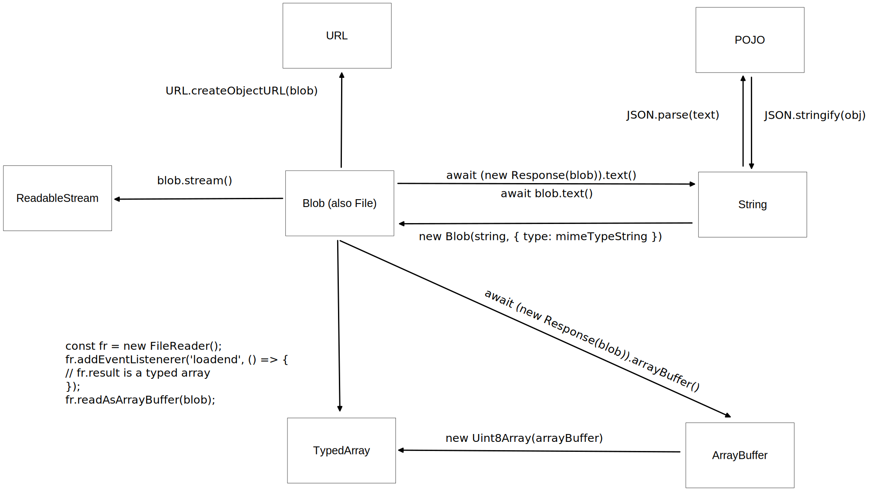

# Browser Object Model

## Fetch API

### HTTP GET:
```javascript
// Using promises
fetch(url)
.then(resp => resp.text())
.then(text => console.log(text))
.catch(err => console.error(err));

// Using async/await
async function example() {
    try {
        const resp = await fetch(url);
        const text = await resp.text(); 
        console.log(text);
    } catch (err) {
        console.error(err);
    }
}
```

### HTTP POST 

**Sending JSON data:**
```javascript
await fetch(url, {
    method: 'POST'
    headers: {
        'Content-Type': 'application/json',
    },
    body: JSON.stringify(data),
});
```

**Sending a file:**
```javascript
// <input type="file">
const input = document.querySelector('input[type="file"]');

// Alternatively: <input type="file" multiple>
// const input = document.querySelector('input[type="file"][multiple]');

const formData = new FormData();
Array.from(input.files).forEach((v, i) => formData.append(`file_${i}`, input.files[i]);
await fetch(url, {
    method: 'POST',
    body: formData
});
```

**Fetching an image:**
```javascript
const image = document.querySelector('.an-image');
fetch(url)
.then(response => response.blob())
.then(blob => {
    const objectURL = URL.createObjectURL(blob); 
    image.src = objectURL;
});
```

**Note**: If response.`type` is "opaque", blob.`size` will be 0 and a blob.`type` will be empty string, which renders it useless for methods like `URL.createObjectURL`.


## Fetch-Related Objects

### Headers Object

This is like a `Map`, but allows multiple values per key. `append` adds to new/existing list of the key. `get` returns a CSV string for the (multiple) values. `set`, `forEach`, `delete`, etc.. exists.

Also see: [HTTP Headers](http-headers.md)

### Request Object

The body type can only be a `Blob`, `BufferSource`, `FormData`, `URLSearchParams`, `USVString` or `ReadableStream` type, so for adding a JSON object to the payload you need to stringify that object.

### Response Object

To read the body of a response, use one of its following methods all of which return a promise:
- `text()`
- `json()`
- `formData()`
- `blob()`
- `arrayBuffer()`
  
The following is also avaiable:
- `body.getReader().read()` (Returns Promise<{`done`: boolean, `value`: Uint8Array}>)

The `Response()` constructor accepts Files and Blobs, so it may be used to read a File into other formats:
```javascript
new Response(file).arrayBuffer()
```

### Note

An `ArrayBuffer` is a generic, fixed-length raw binary data buffer. Cannot directly manipulate the contents. Instead it can be used in the constructor of a `TypedArray` type. A TypedArray object () describes an array-like view of an underlying binary data buffer. There is no global property named TypedArray, nor is there a directly visible TypedArray constructor.

Example:
```javascript
const arrayBuffer = await resp.arrayBuffer();
const bytes = new UInt8Array(arrayBuffer);
```

The `Blob` object represents a blob, which is a file-like object of immutable, raw data; they can be read as text or binary data, or converted into a `ReadableStream` so its methods can be used for processing the data.




[More on Mozilla](https://developer.mozilla.org/en-US/docs/Web/API/Fetch_API/Using_Fetch)

## History

```javascript
history.back();
history.forward();
history.go(-1); // Go back
history.go(1); // Go forward

// pushState/replaceState:
// Arg #1 is custom serializable object that represents state
// Arg #2 is not typically used
// Arg #3 is the URL to be shown in the address bar, but won't actually navigate there
history.pushState(someStateObj, '', optionalUrl);
history.replaceState(someOtherStateObj, '', optionalUrl);

window.onpopstate = (event) => { 
    // The state is of the top of the stack (not of the one that was popped)
    console.log(event.state); 
};
history.back();
```

[More on Mozilla](https://developer.mozilla.org/en-US/docs/Web/API/History_API/Working_with_the_History_API)

## Storage

Use `localStorage` for persistent store, `sessionStorage` for temporary store. They share the same API.

```javascript
let text;

localStorage.setItem('key', 'stringValue');
text = localStorage.getItem('key');
console.log(localStorage.length, localStorage.key(0));  // 1 'stringValue'
localStorage.removeItem('key');
localStorage.clear();

sessionStorage.setItem('key', 'stringValue');
text = sessionStorage.getItem('key');
sessionStorage.removeItem('key');
sessionStorage.clear();
```

## Workers

1. Use `onmessage` of `Worker` on the UI thread:

```javascript
let w;
function startWorker() {
    if(!w) {
        w = new Worker("worker.js");
        w.onmessage = (event) => console.log(event.data);
    }
}
function stopWorker() { 
    if (w) {
        w.terminate();
        w = undefined;
    }
}
```

2. Use `postMessage` on the worker file worker.js:
```javascript
let i = 0;
setInterval(() => postMessage(i++), 500);
```

## Geolocation

```javascript
navigator.geolocation.getCurrentPosition((gp) => {
    // Available properties:
    gp.timestamp;
    gp.coords.accuracy;
    gp.coords.latitude;
    gp.coords.longitude;
    gp.coords.altitude;
    gp.coords.altitudeAccuracy;
    gp.coords.heading;
    gp.coords.speed;
});
```
