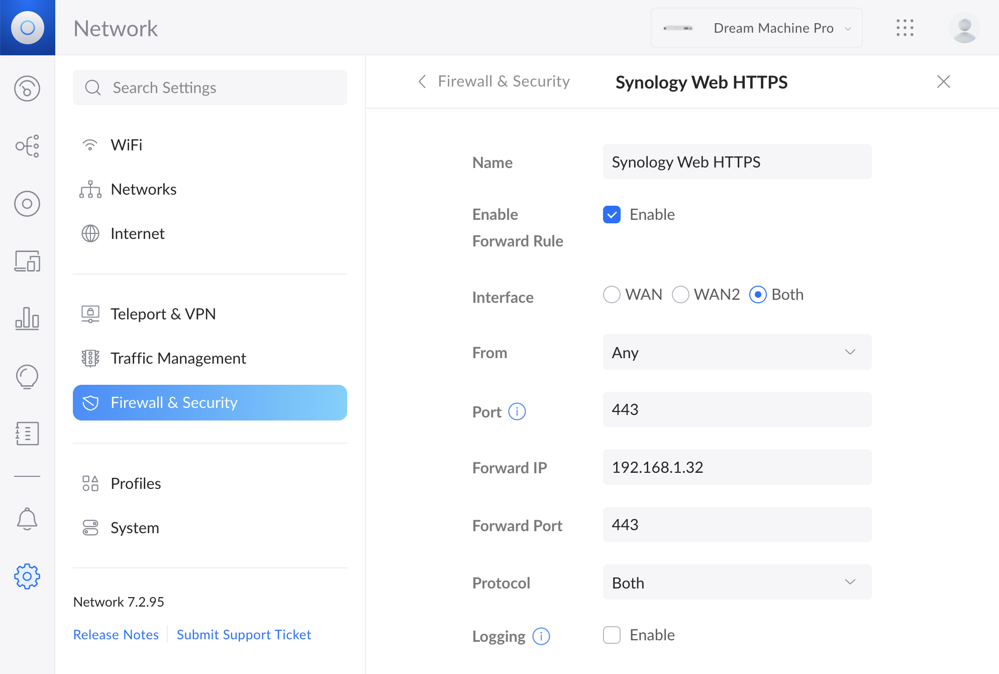
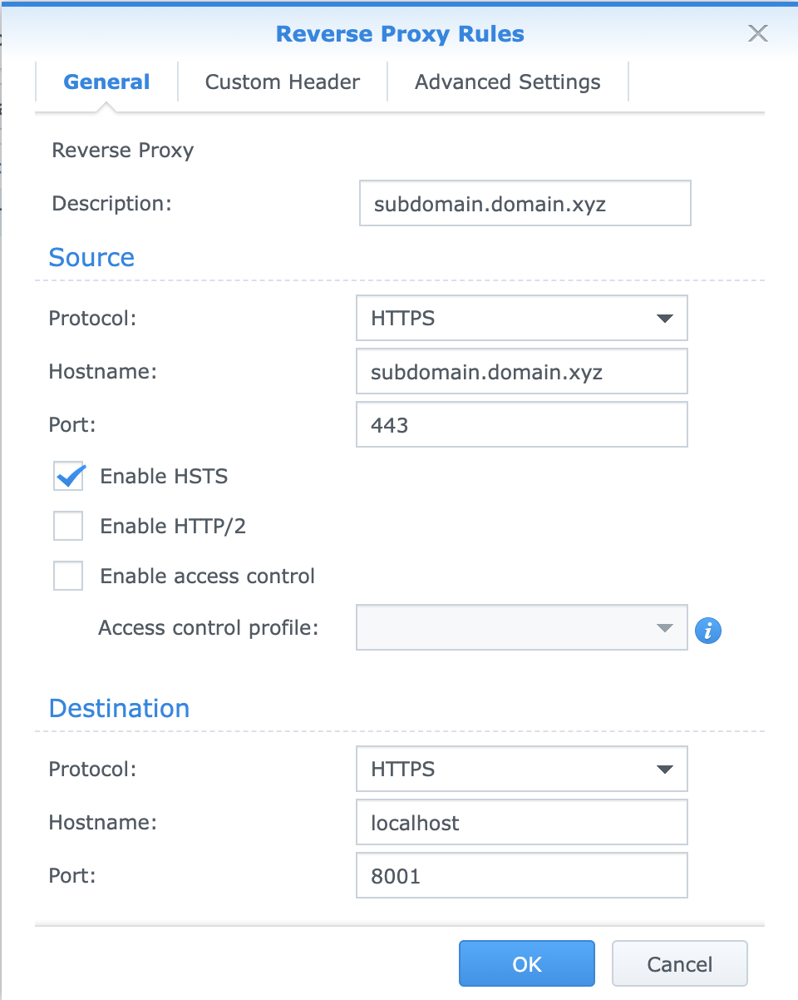

# Setting up SSL for a Node server running on Synology Diskstation

This page provides information on how I configured a new SSL for a node server I have running on my Synology DiskStation (aka NAS). This is Part 2 in the series and assumes certain configurations descrived there. Refer to [Part 1](nas-node.md).

## Goal

I want to have the website I'm hosting on my home NAS to be accessible securely via HTTPS, as a subdomain to my NAS domain. 

**The problem?** My domain has a standard SSL certificate, which only covers the top-level domain and the `www` subdomain. Any subdomains either need to get their own certificates, or the top-level domain needs a `wildcard certificate`, which is quite expensive.

**The solution?** Use free certificates from [Let's Encrypt](https://letsencrypt.org/). They are legit. The only downside is that the certificates have to bew renewed every 3 months, but this can be automated.

Below, I will describe the steps to get an SSL for the subdomain (while keeping my existing SSL certificate for the root domain) and how to configure everything to make it work.

## A note on my existing configuration

### Hardware 

I have a **Synology DS416Play** for my NAS (Network Access Storage). It's connected to a [Ubiquiti UniFi Dream Machine Pro](https://store.ui.com/collections/unifi-network-unifi-os-consoles/products/udm-pro) as the router.

### Network

My domain is registered by [GoDaddy](https://www.godaddy.com/). I have a **Standard SSL certificate** for this domain issued by GoDaddy. I can manage these SSLs [here](https://ssl-ccp.godaddy.com/cert).

The DNS settings can be found under [DNS Management](https://dcc.godaddy.com/manage/dns). The `A` record, which has a name of `@`, is set to the WAN IP number of my router. For subdomains, the `CNAME` is used. I already have `www` configured to point to `@`. 

The WAN IP can be retrieved using the `Network` application at [unifi.ui.com](https://unifi.ui.com) from the `Internet` section. 

The DHCP on the router is configured to give the NAS always the same LAN IP (192.168.1.32). This is done in the `Network` application, under `Client Devices`. Search for the Synology device, select it  and use `Settings` to enable `Fixed IP`.

The router is also configured to route HTTP and HTTPS requests (at port 80 and 443, respectively) to the same PORT on the LAN IP address of the NAS. This is done in the `Network` appplication, under `Firewall & Security` in `Port Forwarding`. 



### Software

On the NAS, I'm running DSM 6.2.4-25556 Update 6. I have the following packages installed:
- Web Station 2.1.10-0160
- Node.js v12
- Node.js v8 (probably not needed)

## Steps

### 1. On the NAS

1. Go to the Web Station, under General Settings, set HTTP back-end server to **Nginx**.
2. Go to the Control Panel > Application Portal
   1. Select the  **Reverse Proxy** tab. 
   2. Create a new entry for the new web service.
      1. Set the Source protocol to `HTTPS`, the hostname to the full domain name, and the port to `443`. I also checked `Enable HSTS`, so that any HTTP requests are automatically renegotiated to HTTPS.
      2. Set the Destination protocol to `HTTPS`, the hotname to `localhost`, and the port to the local PORT you're running the service. (e.g. 8001)
3. Go to the Control Panel > Security
   1. Select the **Certificate** tab.
   2. Add a new certificate
   3. Select `Get a certificate from Let's Encrypt`.
      1. As the Domain name, put in the root domain name. (e.g. `domain.ext`)
      2. Enter your email
      3. As the Subject Alternative Name, put in the full domain name (e.g. `subdomain.domain.ext`)
      4. Wait about a minute or two for the cert to be generated.
   4. To download the certificate:
      1. Select the newly added certificate (issued by R3).
      2. Click the little dropdown icon in the Add button
      3. Select Export certificate.
      4. Open the downloaded file `archive.zip` to extract the files. If you're on macOS, this will extract the files to `~/Downloads/archive`. We will use these files in our Node service in the next section.
   5. Click Configure
      1. For the entry that corresponds to your node service, ensure in the certificate dropdown that the new certificate is selected.

### 2. On your local dev machine

1. Open a terminal
2. `cd ~/HOSTNAME/SHARE/cert`
3. `cp ~/Downloads/archive/*.* .` - assuming this is where the certificate ZIP file was extracted to 
4. Modify your Node project to refer to the correct files, e.g.
    ```javascript
    const certPath = path.join(__dirname, '..', 'cert');
    const httpsOptions = {
        key: readFile(certPath, 'privkey.pem'),
        cert: readFile(certPath, 'cert.pem')
    }; // options to be used with https.createServer()
    ```
5. `ssh HOSTNAME -p 220` - where HOSTNAME is the local name of your NAS
6. `cd /volume1/SHARE/web` - where the path is configured according to [nas-node.md](nas-node.md)
7. Start your node server. Pay attention to which port it uses.

## Summary

If everything has worked well, when you go to `https://yoursubdomain.yourdomain.yourext` in a browser, the request should work without any certificate issues. This is my understanding of what is basically happening when you make this request:

1. The browser checks the DNS for the FQDN. 
2. The DNS records, as configured by the domain registrar (in my case GoDaddy) maps the FQDN to an IP number.
3. The browser makes the request to the IP number at port 443, which is implied by the HTTPS request.
4. The home router receives and redirects the request at port 443 to the LAN IP address of the NAS as configured in its Port Forwarding rules.
5. On the NAS, Nginx receives the request. Since it's an HTTPS request, it checks the certificates for this FQDN.
6. Once certificates are validated, the request is sent to `https://localhost:8001` as configured in the reverse proxy configuration.
7. Our Node service receives the request. The Node HTTPS server checks the request against the local certificates we have configured it with, and serves the traffic normally.
